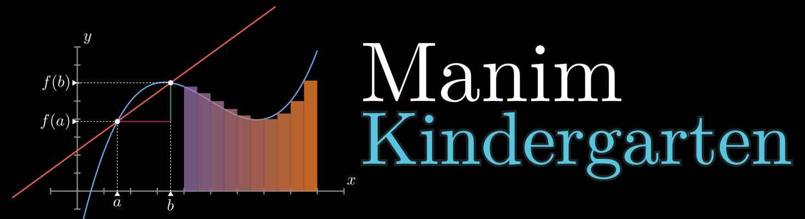

[Here is the way to the README in English](https://github.com/manim-kindergarten/manim_sandbox/blob/master/README-EN.md)

manim_sandbox是由[manim-kindergarten](https://github.com/manim-kindergarten)的成员所管理维护的一个代码仓库，目的在于汇总整合各成员提供的[manim](https://github.com/3b1b/manim)代码和模块。

运行该项目中的代码需配置好[manim](https://github.com/3b1b/manim)才能运行。部分代码所用的manim版本可能在[3B1B](https://github.com/3b1b)的[manim](https://github.com/3b1b/manim)的基础上略有删改。

其中一些素材和地址等由于某些文件的移动path可能有些不对，需要修改才能运行。   
由于编程水平有限，加上对Grant的代码理解有限，代码有时会出现不太好的实现方式，敬请谅解。

## 关于成员

此外，不少[manim-kindergarten](https://github.com/manim-kindergarten)的成员都是[B站](https://www.bilibili.com/)up主，项目中的不少代码可能会用到相关的[B站](https://www.bilibili.com/)视频中。 

以下是部分成员的[B站](https://www.bilibili.com/)主页链接和GitHub中的相关manim项目链接：

<table>
  <tr>
    <td rowspan="2">
      
    </td>
    <td><a href="https://space.bilibili.com/3557916/">Solara570的B站主页</a></td>
  </tr>
  <tr>
    <td><a href="https://github.com/Solara570/demo-solara">GitHub中manim项目</a></td>
  </tr>
  <tr>
    <td rowspan="2">
      
    </td>
    <td><a href="https://space.bilibili.com/66806831/">cigar666的B站主页</a></td>
  </tr>
  <tr>
    <td><a href="https://github.com/cigar666/my_manim_projects">GitHub中manim项目</a></td>
  </tr>
  <tr>
    <td rowspan="2">
      
    </td>
    <td><a href="https://space.bilibili.com/171431343/">鹤翔万里的B站主页</a></td>
  </tr>
  <tr>
    <td><a href="https://github.com/TonyCrane/manim_projects">GitHub中manim项目</a></td>
  </tr>
  <tr>
    <td rowspan="2">
      
    </td>
    <td><a href="https://space.bilibili.com/10707223/">pdcxs的B站主页</a></td>
  </tr>
  <tr>
    <td><a href="https://github.com/pdcxs/ManimProjects">GitHub中manim项目</a></td>
  </tr>
  <tr>
    <td rowspan="2">
      
    </td>
    <td><a href="https://space.bilibili.com/387821788/">有一种悲伤叫颓废的B站主页</a></td>
  </tr>
  <tr>
    <td><a href="https://github.com/136108Haumea/my-manim">GitHub中manim项目</a></td>
  </tr>
</table>

manim-幼儿园的项目成员也利用manim合作制作了许多非常amazing的视频以及十分有用的manim教程，目前已有多期视频在[B站](https://www.bilibili.com/)投稿：

视频列表

<table>
  <tr>
    <td>
      
    </td>
    <td><a href="https://www.bilibili.com/video/BV1P741117QQ">自然数立方和公式的七种妙证</a></td>
  </tr>
  <tr>
    <td>
      
    </td>
    <td><a href="https://www.bilibili.com/video/BV1zC4y147T3">十二例amazing的包络线欣赏</a></td>
  </tr>
  <tr>
    <td>
      
    </td>
    <td><a href="https://www.bilibili.com/video/BV1p54y197cC">manim教程 第一讲 物体的位置与坐标变换</a></td>
  </tr>
  <tr>
    <td>
      
    </td>
    <td><a href="https://www.bilibili.com/video/BV1kA411b7kq">manim教程 第二讲 manim常用几何类</a></td>
  </tr>
  <tr>
    <td>
      
    </td>
    <td><a href="https://www.bilibili.com/video/BV1vZ4y1x7hT" title="这个是翔鸽单独完成哒">manim教程 第三讲 颜色的表示、运算与设置</a></td>
  </tr>
  <tr>
    <td>
      
    </td>
    <td><a href="https://www.bilibili.com/video/BV1CC4y1H7kp" title="这个也是翔鸽单独完成哒">manim教程 第四讲 SVG、图片与文字</a></td>
  </tr>
  <tr>
    <td>
      
    </td>
    <td><a href="https://www.bilibili.com/video/BV1ug4y1q7nu/" title="这个还是翔鸽单独完成哒">manim教程 第五讲 坐标系统与图像</a></td>
  </tr>
</table>

## 关于manim的学习和交流

我们有一个manim交流群（QQ群：862671480），欢迎大家加入交流。 
对于manim学习中可能遇到的问题，可参考[manim常见问题](https://github.com/manim-kindergarten/manim_sandbox/blob/problems/problems.pdf)，如果不方便在线查看，[点此下载](https://github.com/manim-kindergarten/manim_sandbox/blob/problems/problems.pdf?raw=True) 

## 关于项目中的代码规范问题

所有代码要尽量符合[PEP-8](https://www.python.org/dev/peps/pep-0008/)规范，并且最好添加符合[PEP-257](https://www.python.org/dev/peps/pep-0257/)规范的文档字符串(DocString)

#### Ⅰ. 一些实用函数/类代码
提交到`utils`文件夹中
  1. 需要在文件头加上`# from @author`一行
  2. 需要在`utils`文件夹中分好类，放入对应子文件夹中
  3. 需要在`utils/imports.py`中添加`import`
  4. 函数/类 需要有文档字符串(函数下的注释)
  5. 尽可能写一些注释方便学习，并要保证代码可读性
#### Ⅱ. 一些示例代码
提交到`demo`文件夹中
  1. 需要在文件头加上`# from @author`一行
  2. 示例尽可能规范，可添加注释说明以方便他人学习
#### Ⅲ. 自己视频的工程文件
提交到`videos`文件夹中
  1. 需要在文件头加上`# from @author`一行
  2. 在文件头部给出视频链接`# video address: https://......`，或将效果视频一并上传(文件名保持一致)
#### Ⅳ. 一些图片素材
提交到`assets`文件夹中
  1. 保证图片可以正常打开
#### Ⅴ. 一些对manim源码的更改
提交到旁边的[repo](https://github.com/manim-kindergarten/manim)中

## 关于代码使用的相关声明

  1. 代码主要用作大家交流学习使用，欢迎大家进行修改和补充 
  2. 允许使用部分相关代码进行视频创作，但如果使用代码较多请注明下出处 
  3. 禁止直接将该项目中的代码做简单无脑修改甚至不修改而做成视频 
  4. 禁止未经允许将本项目的代码用作其他商业行为 

最后，祝大家好运ღ( ´･ᴗ･` )
------------------
